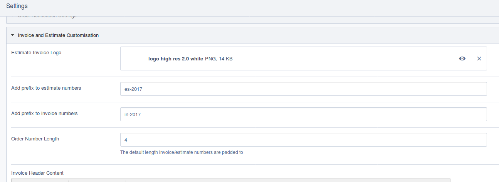

# Configuration Options

You can configure orders and invoices in several ways:

## Invoice/Estimate customisation via siteconfig

A lot of invoice customisation is done via `SiteConfig`. This way if
you are running several sites/stores through one install (the best example
of this would be via `silverstripe-subsites`), each one can have independant
config.

Via `SiteConfig` you can customise:

* A prefix for invoice and estimate numbers.
* The invoice/estimate number length (defaults to 4 characters).
* The company logo that appears in rendered invoices/estimates
* HTML content that can be addded to the header of an invoice/estimate
* HTML content that can be added to the footer of an invoice/estimate.

All of these settings can be accessed by logging into the admin of your
SilverStripe site and visiting:

Settings > Shop > Invoice and Estimate Customisation

## Other configuration options

Other options that can be set directly via SilverStripe
config options.

### Status configuration on an invoice

Invoices can have a status (such as paid, part-paid, canceled, dispatched) as well
as other status related configurations.

#### Available Statuses

To add new statuses, use the config variable: `Invoice.statuses`

#### Paid Statuses

To change the statuses that an `Invoice` considers "Paid" use: `Invoice.paid_statuses`

#### Default Status
To change the default status assigned to an `Invoice` use: `Invoice.default_status`

#### Workflow Statuses

By default, invoices have the following workflow statuses:

* incomplete
* processing
* paid
* part-paid
* dispatched
* collected
* refunded
* cancelled

These can be used to determine the current "state" of an invoice, and can be easily set via
the relevent "mark(Status)" function.

You can changed these via config, using the relevent status config (for example, to set
the "paid" status, change `Invoice.paid_status`).